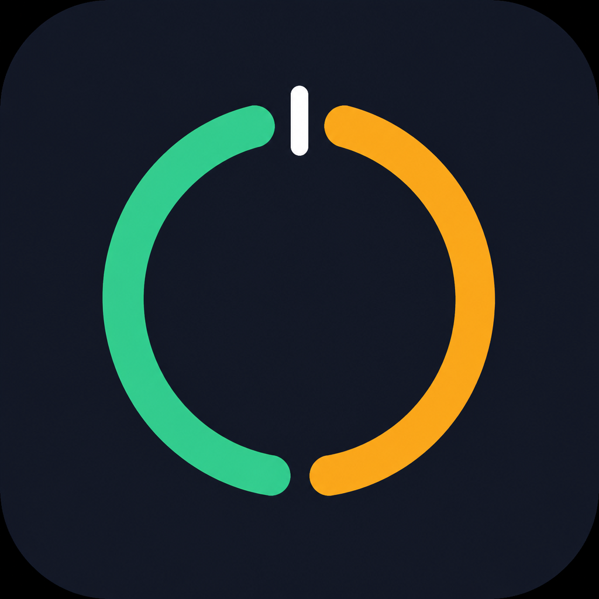

<p align="center">
  
</p>

# Cursor Token Usage

**在状态栏显示 Cursor 现行 token 计费用量的 VS Code / Cursor 扩展**

[](https://github.com/Akito-Go/Cursor-Token-Usage/releases)
[](https://marketplace.visualstudio.com/items?itemName=akitogo.cursor-token-usage)
[](https://open-vsx.org/extension/akitogo/cursor-token-usage)
[](LICENSE)

[中文](#cursor-token-usage) · [English](#english) · [快速开始](#快速开始) · [核心特性](#核心特性) · [认证](#认证) · [界面](#操作界面) · [FAQ](#常见问题)

---

Cursor 已改为按 token、双池计费（不再是旧的「fast-premium 请求次数 + 美元」）。本扩展读取 dashboard 接口，按账号类型切换展示：个人看双池百分比，团队 / 企业看套餐内花费。

## 核心特性

| **状态栏常驻** 个人：`C xx% · O xx%` 团队 / 企业：套餐内已用 vs 上限（接口美分，非本地估算） | **详情面板** 点击状态栏：环形用量、彩色进度条、按模型 Token、最近事件、趋势图 |
| --- | --- |
| **账号自适应** 类型来自接口（`individual` / `team` / `enterprise`），不从 token 猜测 | **用量提醒** 两次轮询之间的变化超过阈值时弹窗，监控项与阈值可配 |

**更多亮点：**

- 自动刷新，默认 30 秒；窗口失焦时降低频率
- 中 / 英界面，跟随编辑器语言
- macOS / Windows / Linux 通用 VSIX，自动读本机 Cursor 会话（`state.vscdb`）
- UI 扩展（`extensionKind: ui`）：SSH Remote、WSL、Dev Containers 下仍读**本机**登录
- 只在接口返回美分时显示 `$`，不用官网单价估算账单

## 快速开始

### 从商店安装

- [Open VSX](https://open-vsx.org/extension/akitogo/cursor-token-usage)（Cursor 扩展市场）
- [VS Code Marketplace](https://marketplace.visualstudio.com/items?itemName=akitogo.cursor-token-usage)

搜 `Cursor Token Usage`，或命令行：

```bash
# Cursor
cursor --install-extension akitogo.cursor-token-usage
```

### 从 VSIX 安装

1. 从 [Releases](https://github.com/Akito-Go/Cursor-Token-Usage/releases/tag/v1.0.6) 下载 `cursor-token-usage-1.0.6.vsix`
2. 拖进 Cursor，或 `Cmd+Shift+P`（Windows：`Ctrl+Shift+P`）→ `Extensions: Install from VSIX...`
3. 执行 `Developer: Reload Window`

装好后状态栏应出现用量。读不到会话时显示 **Set Token**，见下方认证。

## 认证

扩展从本机 `state.vscdb` 读取 `cursorAuth/accessToken` 与用户 id，拼成 `WorkosCursorSessionToken` Cookie，**只发给 `cursor.com`**。

| 系统 | 会话文件 |
| --- | --- |
| macOS | `~/Library/Application Support/Cursor/User/globalStorage/state.vscdb` |
| Windows | `%APPDATA%\Cursor\User\globalStorage\state.vscdb` |
| Linux | `~/.config/Cursor/User/globalStorage/state.vscdb` |

自动读取需要 PATH 上有 **Python 3**（`python3` / `python`，Windows 可用 `py`）。没有 Python 时用 **Set Session Token**，其余功能仍可用。

自动检测失败时：

1. 命令面板 → **Cursor Token Usage: Set Session Token**
2. 粘贴 `WorkosCursorSessionToken`（格式：`userId%3A%3AaccessToken`）
3. Token 写入 VS Code SecretStorage，不进 `settings.json`

浏览器取 Cookie：打开 [cursor.com](https://cursor.com) → 开发者工具 → Application → Cookies → 复制 `WorkosCursorSessionToken`。

**远程工作区：** 本扩展在本机 Cursor 进程跑，不要装到 SSH / WSL / 容器远端。

## 操作界面

```
状态栏（个人）：     $(graph) C 42% · O 18%
状态栏（团队/企业）： $(graph) $67.88/$52.00

详情面板
┌─────────────────────────────────────────────┐
│ Cursor Token Usage              enterprise  │
│ 重置倒计时：12天4小时        Token 合计 1.2M │
│                                             │
│   (  131%  )   套餐内用量                    │
│                $67.88 / $52.00              │
│ ████████████████████████████░░░░  已超 100% │
│ Cursor Models   ████████░░░░░░░░     42%    │
│ Other Models    ███░░░░░░░░░░░░░     18%    │
│ On-Demand       $5.74                       │
│                                             │
│ 按模型                                      │
│ claude-4.6-opus  ████████████████    80.1万  │
│ gpt-5            ██████░░░░░░░░░░    12.4万  │
│                                             │
│ 最近消耗                                    │
│ 08-13 21:04  Claude 4.6 Opus  Included  2.1万│
└─────────────────────────────────────────────┘
```

进度条：绿 < 40%、黄 < 80%、橙 ≥ 80%、红 ≥ 100%。用量 ≥ 80% 状态栏警告底色，≥ 100% 错误底色。

面板按钮：刷新、设置 Session Token、状态栏位置、配置提醒。

## 配置

| 配置项 | 默认 | 说明 |
| --- | --- | --- |
| `cursorTokenUsage.displayCount` | 5 | 详情面板最近用量条数 |
| `cursorTokenUsage.pollingInterval` | 30 | 轮询间隔（秒，5–300） |
| `cursorTokenUsage.showStatusBar` | true | 是否显示状态栏 |
| `cursorTokenUsage.statusBarAlignment` | `right` | 状态栏位置：`left` / `right` |
| `cursorTokenUsage.alertEnabled` | true | 启用用量变化提醒 |
| `cursorTokenUsage.alertItems` | `newSession` `overallSpending` `cursorModels` `otherModels` `totalTokens` | 监控项 |
| `cursorTokenUsage.alertThreshold.newSession` | 2 | 单次轮询新增调用数 |
| `cursorTokenUsage.alertThreshold.overallSpending` | 1 | 套餐内花费变化（$） |
| `cursorTokenUsage.alertThreshold.cursorModels` | 10 | Cursor Models 池变化（%） |
| `cursorTokenUsage.alertThreshold.otherModels` | 10 | Other Models 池变化（%） |
| `cursorTokenUsage.alertThreshold.onDemandSpending` | 1 | On-Demand 花费变化（$） |
| `cursorTokenUsage.alertThreshold.totalTokens` | 100000 | Token 总量变化 |

## 命令

| 命令 | 作用 |
| --- | --- |
| Show Token Usage Details | 打开详情面板（等同点击状态栏） |
| Refresh Token Usage | 立即刷新 |
| Set Session Token | 粘贴 / 清除 Session Token |
| Set Polling Interval | 5–300 秒 |
| Set Status Bar Side | 左 / 右 |
| Configure Usage Alerts | 开关、监控项、阈值 |

## 用量提醒

1. 命令面板 → **Configure Usage Alerts**，或详情面板里的提醒按钮
2. 开启提醒 → 选监控项 → 设阈值
3. 可监控：新增调用、套餐内花费、Cursor Models %、Other Models %、On-Demand 花费、Token 总量
4. 阈值 `0` 表示任何变化都提醒

> 阈值看的是**两次轮询之间的变化量**，不是累计或绝对上限。例如 `onDemandSpending = 1.0`：两次成功轮询之间 On-Demand 增加 $1.00 或以上才触发。

## 常见问题

**为什么不估算美元？**

自助套餐的用量事件里，美元经常是 `$0`（`chargedCents: 0`），即使已经消耗 token。用 token × 官网单价对不上账单：套餐额度、团队 / 企业折扣、Cursor Token Rate 都在服务端结算。只有接口自己返回美分时才显示 `$`。Token 始终按 token 显示。

**状态栏一直是 Set Token？**

先确认本机已登录 Cursor，PATH 上有 Python 3。仍失败就用 **Set Session Token** 粘贴 `WorkosCursorSessionToken`。

**远程 SSH / WSL 读不到用量？**

扩展必须装在**本机** Cursor，不要装到远端。它是 UI 扩展，只读本机 `state.vscdb`。

**提醒太频繁 / 从不响？**

阈值是相邻两次轮询的 delta。把 `pollingInterval` 和对应 `alertThreshold.*` 调大或调小；`0` 表示有变化就提醒。

## 从源码构建

```bash
npm install
npm run compile
npx @vscode/vsce package --no-dependencies
```

安装生成的 `.vsix` 后执行 **Developer: Reload Window**。打 Open VSX 包请用 `vsce`，不要用系统 `zip`（带 extra fields 会被拒）。

## 更新说明（1.0.6）

- 读不到会话时状态栏显示 **Set Token**
- 英文 Token 单位用 K/M，中文满万仍用「万」
- 窗口失焦时降低轮询频率
- 按模型进度条显示占总用量比例
- 趋势图：Token 为输入 / 输出 / 缓存堆叠柱 + 折线；费用仅在接口返回美分时绘制；可按模型筛选；悬停看明细；日期范围可选
- 团队 / 企业：始终显示 On-Demand（接口美分，含 $0）
- Webview 跟随 Cursor 浅色 / 深色主题（`--vscode-*` 变量）

## 参与贡献

欢迎 Issue 和 Pull Request。

1. Fork 本仓库
2. `git checkout -b feature/your-feature`
3. 提交更改
4. 开 Pull Request

## 开源协议

[MIT](LICENSE)

---

Created by [Akito-Go](https://github.com/Akito-Go) — 觉得有用请点个 Star。

---

## English

A VS Code / Cursor extension that shows **live Cursor token billing** on the status bar. Click it for a details panel: usage ring, per-model tokens, recent events, and a trend chart.

Cursor bills by tokens in two pools (not the old “fast-premium requests + dollars” model). Display follows the account type returned by the API.

**Install:** [Open VSX](https://open-vsx.org/extension/akitogo/cursor-token-usage) · [Marketplace](https://marketplace.visualstudio.com/items?itemName=akitogo.cursor-token-usage) · [VSIX v1.0.6](https://github.com/Akito-Go/Cursor-Token-Usage/releases/tag/v1.0.6)

**Auth:** reads local `state.vscdb` (`cursorAuth/accessToken` + user id) and sends `WorkosCursorSessionToken` to `cursor.com` only. Needs Python 3 on PATH, or **Set Session Token**. Token goes to SecretStorage, never `settings.json`. This is a **UI extension** — install locally for SSH / WSL / Dev Containers.

**Status bar:** individual `C xx% · O xx%`; team / enterprise included spend vs limit (API cents). Colors: green < 40%, yellow < 80%, orange ≥ 80%, red ≥ 100%.

**Alerts:** delta between two polls, not a lifetime cap. `0` = any change.

**Why no estimated $:** self-serve events often return `chargedCents: 0`. List-price × tokens will not match the invoice. `$` is shown only when the API returns cents.

See the Chinese sections above for the full settings table, commands, and panel mockup.
